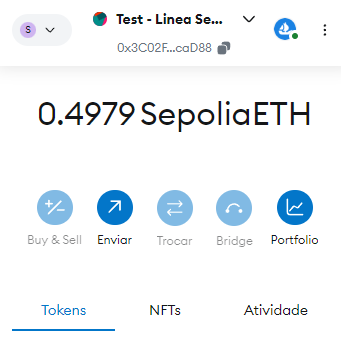
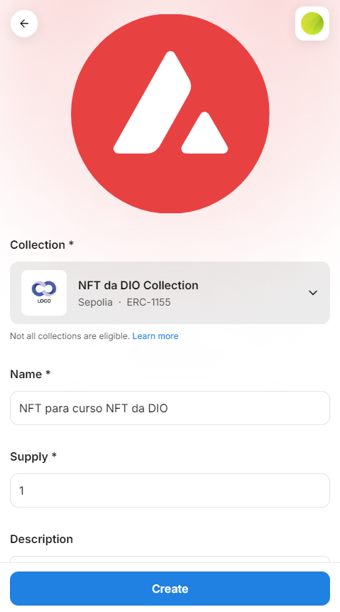
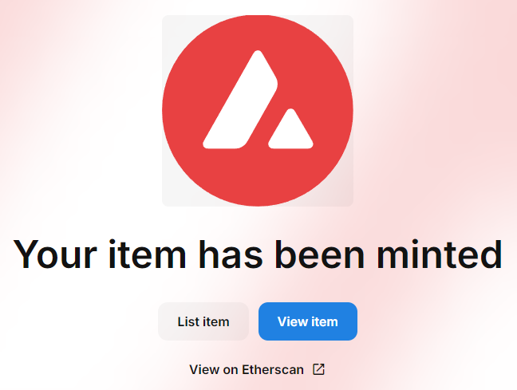
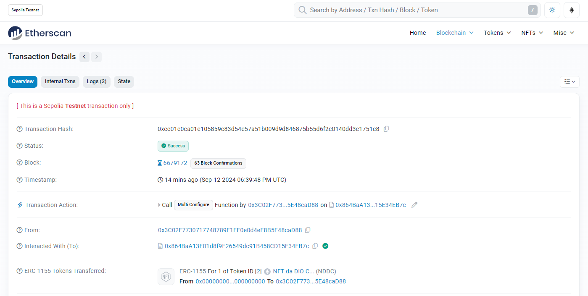
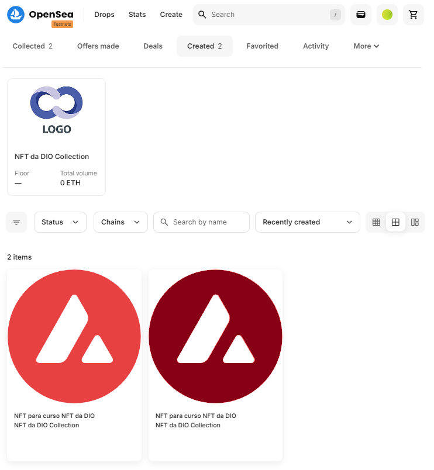

# Atividade - criação de NFT

Criação de NFT em [testnets.opensea](https://testnets.opensea.io/)

## 1º Deve carregar algum saldo para uma carteria

## 2º Conectar no site

É necessario permitir a conexão com o site da [testnets.opensea](https://testnets.opensea.io/)

## 3º Criação de Collection + Item

Criado collection genérica. Criado item de coleção pela interface do site, conforme imagem:

## 4º Verificação final

Observando no próprio Metamask
- Deverá ter consumido algum saldo, com a realização do mint da NFT.
- Nas atividades, pode verificar as movimentações, neste caso a cunhagem da NFT.

Nas atividades, observando a interação com o contrato podemos navegar para o verificador de blocos, ou também pelo link apresentado no site após a criação do NFT.

## 5º Profile

Por fim no seu perfil, terá como visualizar suas coleções e NFTs criadas.

